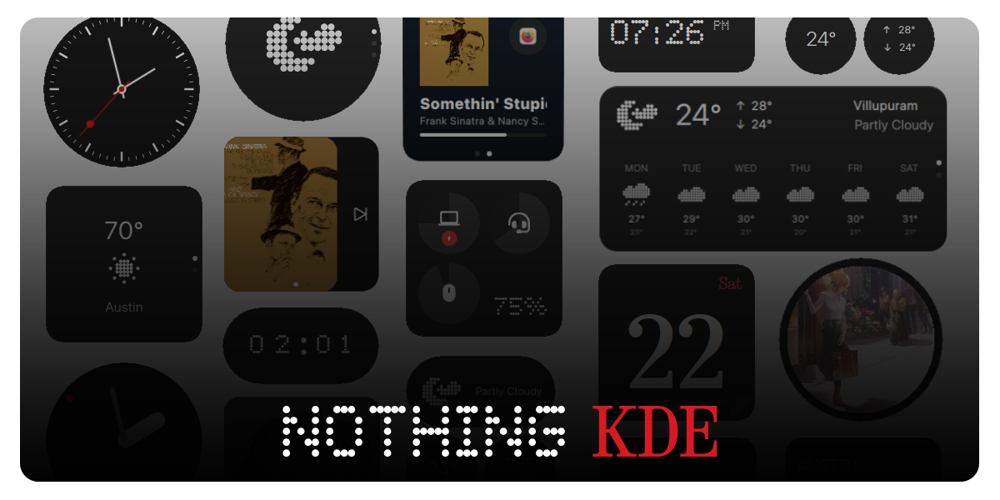
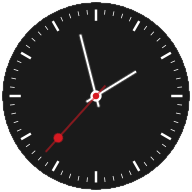
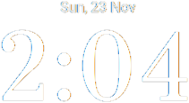
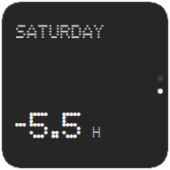
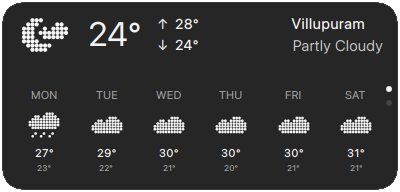
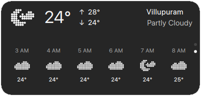
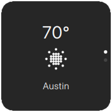
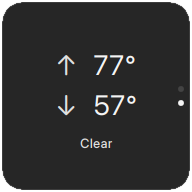
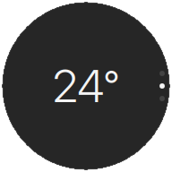
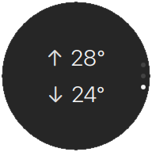

# Nothing KDE Widgets



<p align="center">
    <i>v1.0</i><br>
    A collection of minimalist KDE Plasma 6 widgets inspired by Nothing's design language<br><br>
    <a href="https://github.com/jaxparrow07/nothing-kde-widgets/releases/latest">
        
    </a>
    <a href="https://www.pling.com/c/2330403/">
        
    </a>
    <a href="https://ko-fi.com/devrinth">
        
    </a>
</p>

---
## Available Widgets

| Widget Name | Package Name | Variants | Preview |
|-------------|--------------|----------|---------|
| **Analog Clock** | `clock-analog` | Modern, Swiss |   |
| **Digital Clock** | `clock-digital` | Pill, Square |   |
| **Digital Clock Large** | `clock-digital-large` | Serif, Sharp |   |
| **World Clock** | `clock-digital-world` | Page 1, Page 2 |   |
| **Date Widget** | `date` | Page 1 |  |
| **Battery** | `battery` | Page 1 |  |
| **Weather** | `weather` | Rect Page 1, Rect Page 2, Square Page 1, Square Page 2 |     |
| **Weather Circular** | `weather-circular` | Circle Page 1, Circle Page 2, Circle Page 3, Grid |     |
| **Media Player** | `media` | Page 1, Page 2 |   |
| **Photo Frame** | `photo` | Pill, Square |   |


## Installation

### Method 1: Using Install Script (Recommended)

**Prerequisites:**
- KDE Plasma 6.0 or higher
- `kpackagetool6` (usually included with KDE Plasma)
- `jq` command-line JSON processor

Clone the repository and run the install script:

```bash
git clone https://github.com/jaxparrow07/nothing-kde-widgets.git
cd nothing-kde-widgets
```

**Install all widgets at once:**

```bash
./install.sh --all
```

or

```bash
./install.sh -a
```

**Install individual widget:**

```bash
./install.sh <package_name>
```

Available package names:
- `clock-analog` - Analog clock widget
- `clock-digital` - Digital clock widget
- `clock-digital-large` - Large digital clock widget
- `clock-digital-world` - World clock widget
- `date` - Date display widget
- `battery` - Battery monitoring widget
- `weather` - Weather widget with multiple layouts
- `weather-circular` - Circular weather widget
- `media` - Media player control widget
- `photo` - Photo frame widget

Example:
```bash
./install.sh clock-analog
```

### Method 2: Install From File

Download the packaged widgets from the [releases page](https://github.com/jaxparrow07/nothing-kde-widgets/releases/latest) and install them by "Loading from a file":

1. **Desktop** → Right Click → **Enter Edit Mode**
2. **Add Widget** → **Get Widgets**
3. **Install Widget From Local File**
4. Select the downloaded `.plasmoid` file

### Method 3: Manual Installation

You can also manually install widgets using `kpackagetool6`:

```bash
kpackagetool6 --type=Plasma/Applet -i packages/<package_name>
```

To update an already installed widget:

```bash
kpackagetool6 --type=Plasma/Applet -u packages/<package_name>
```

After installation, restart Plasma Shell:

```bash
killall plasmashell && kstart plasmashell
```

---

## Battery Widget - Bluetooth Setup

The battery widget can display battery levels for Bluetooth devices like mice, keyboards, and earbuds. Follow these steps to enable Bluetooth battery monitoring:

### 1. Install Required Packages

```bash
sudo apt update
sudo apt install -y bluez bluez-tools qml-module-org-kde-bluezqt
```

### 2. Enable Bluetooth Service

```bash
sudo systemctl enable bluetooth.service
sudo systemctl start bluetooth.service
```

### 3. Enable Experimental Features for Battery Reporting

Some Bluetooth devices require experimental features to report battery levels. Edit the Bluetooth service:

```bash
sudo systemctl edit bluetooth.service
```

Add these lines:

```ini
[Service]
ExecStart=
ExecStart=/usr/sbin/bluetoothd -E
```

Save and apply changes:

```bash
sudo systemctl daemon-reload
sudo systemctl restart bluetooth.service
```

### 4. Pair Your Bluetooth Devices

Using bluetoothctl:

```bash
bluetoothctl
```

Inside bluetoothctl:

```
power on
agent on
default-agent
scan on
```

Wait for your device to appear, then pair it:

```
pair XX:XX:XX:XX:XX:XX
trust XX:XX:XX:XX:XX:XX
connect XX:XX:XX:XX:XX:XX
exit
```

### 5. Verify Battery Support

Check if your device reports battery information:

```bash
bluetoothctl info XX:XX:XX:XX:XX:XX | grep -i battery
```

### 6. Reload the Battery Widget

After setup:
1. Right-click the battery widget → Remove
2. Right-click desktop → Add Widgets
3. Find and add the Battery Widget
4. Your Bluetooth devices should now appear with battery levels

For detailed troubleshooting and additional information, see [BLUETOOTH_SETUP.md](BLUETOOTH_SETUP.md).

---

## Copyright & Attribution

### Fonts
This project includes fonts from Nothing Technology Limited's design system:
- **NDot Font Family** (ndot.ttf, ndot-55.otf, ndot-big.ttf)
- **NType82 Font Family** (ntype82-regular.otf, ntype82-light.otf, ntype82-headline.otf)
- **Arrow Fonts** (arrow_shape_f.ttf, arrow_subway.ttf)
- **Roboto** (roboto.ttf) - Licensed under Apache License 2.0

All Nothing fonts are trademarks of Nothing Technology Limited. These fonts are included for personal and non-commercial use only. For commercial use, please contact Nothing Technology Limited.

### Icons
Weather and battery icons are custom-designed in the Nothing style or sourced from open-source icon sets. Icon attribution:
- Weather icons: Custom Nothing-style icons
- Battery icons: Custom Nothing-style icons

### License
This project is licensed under GPL-2.0+ and GPL-3.0+ (varies by widget). See individual widget metadata for specific license information.

### Disclaimer
This project is not affiliated with, endorsed by, or sponsored by Nothing Technology Limited. All product names, logos, and brands are property of their respective owners.

---

## Contributing
Contributions are welcome! Please feel free to submit issues and pull requests on [GitHub](https://github.com/jaxparrow07/nothing-kde-widgets).

## Support
If you like these widgets, consider supporting the development:

<a href="https://ko-fi.com/devrinth">
    
</a>
